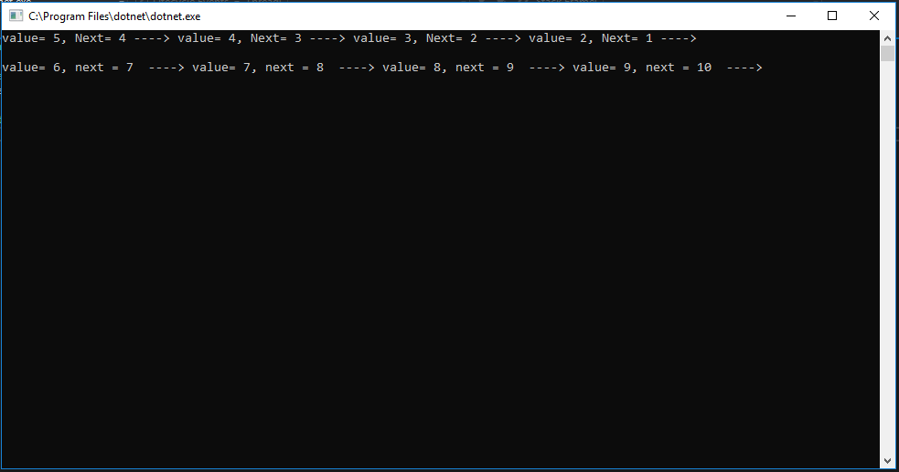

# Implement Stack and Queue

## Summary of Challenge
- Implement the functionalities for Stack class Push and Pop methods, and Queue class Enqueue and Dequeue methods.

## Explanation
- Stack class contains First-in Last-out, and Last-in First-out approach. With stack approach, point of entry and exit will always be the same.
- Queue class contains First-in First-out, and Last-in Last-out approach. With Queue, Nodes will always be added from Rear and always be removed from Front.

