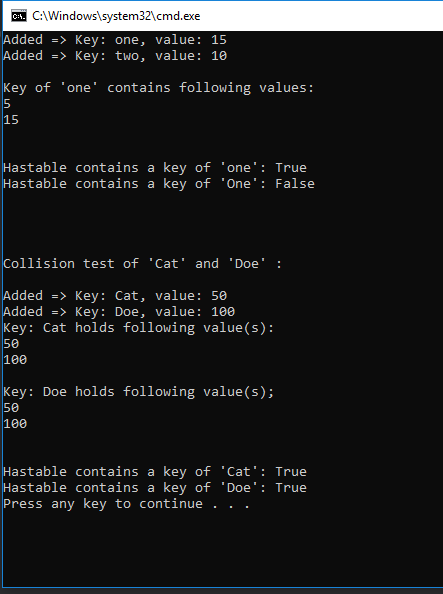

# Implement Hashtable

## Summary
- Create a Hashtable methods:
	1. Add(key, value)
		- Adds key/value to a hashtable
	2.	Find(key)
		- Finds a key and return the values
	3. Contains(key)
		- Finds a key and returns boolean
	4. GetHash(key)
		- Create a hashing algorithm to determine the locaion of key/value

## Visual

## Solution
- Once string of a key/value is inputted, it identifies ASCII integer based on the inputted key string. Calculated ASCII integer is
multiplied by highest prime number (599), and divided by number of indexes in an array (1024). Once calculation is done, it
rounds by a lowest number ( .Floor() ) and adds the value to the index of the calculated value.

