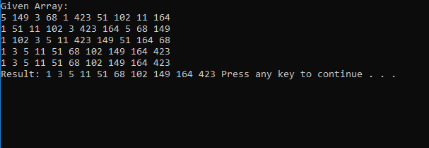

# Radix Sort

## Summary
- Create a method that takes an unsorted array, and sort the array using Radix sort.

## Solution
- I implemented a method with bucket using list of Queues. After calculating the each of integers with its value of position,
I enqueued into the appropriate position in the list of queues. Once all the integers were enqueued into the bucket, 
I dequeued back  to the array. I repeated this process.

## Whiteboard
