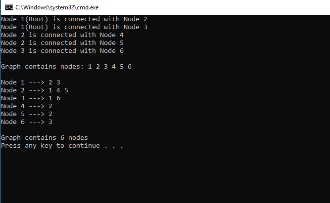
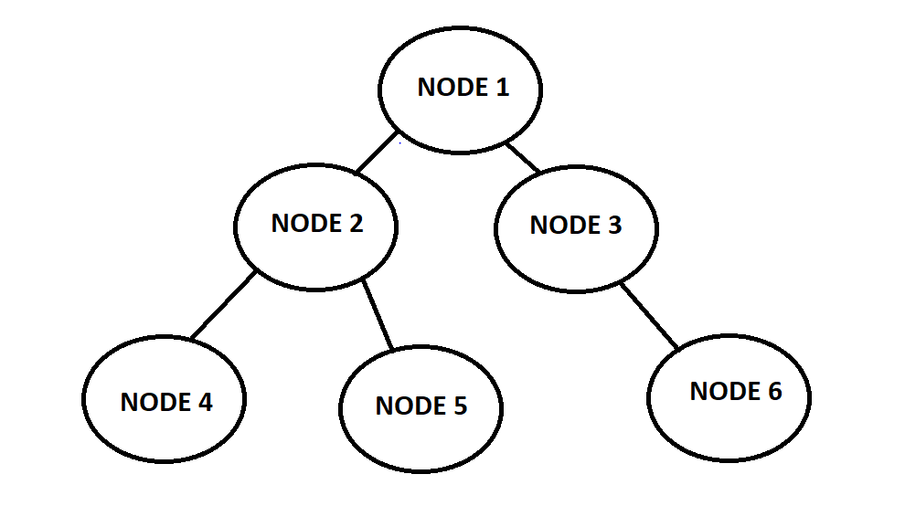

# Implement Graph

## Directions
- Implement a graph as an Adjacency list that implement the following 
	1. AddEdge() 
		- Adds a new vertex to the graph 
	2. GetNodes() 
		- Returns all of the nodes in the graph as a collection 
	3. GetNeighbors() 
		- Returns a collection of nodes that are connected to the given node 
	4. Size() 
		- Returns the total number of nodes in the graph 
	5. BreadthFirst() 
		- Takes a root node, and returns a collection of all the nodes visited in order. 
 
- Should contain following classes: Program, Node, and Graph, 
- Test the functionalities of graph:  
	- Size() returns the correct number of nodes back 
	- GetNeighbors() returns the correct nodes given a vertice 
	- Successfully able to Add an edge. 

## Visual

## Real life utilization
- Graphs is utilized in various different industries for different purposes. It can be used for plane traffics and GPS mapping purposes, also Social Network Platforms for connecting the data.